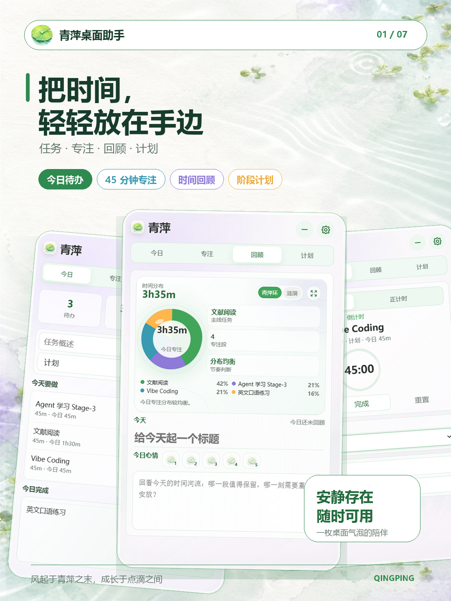
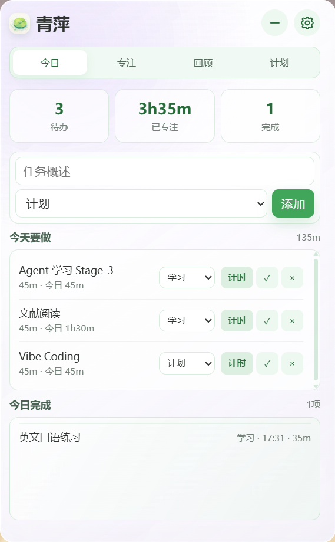
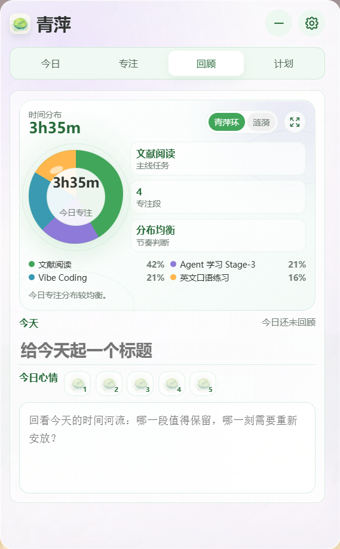
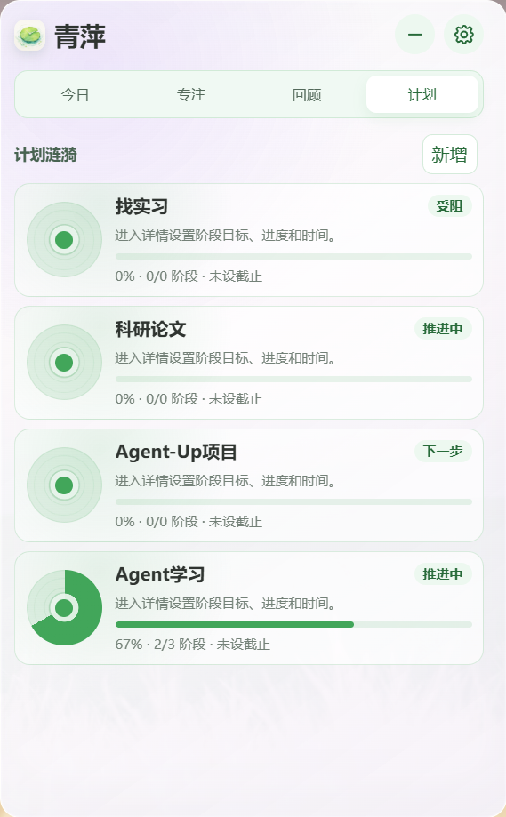
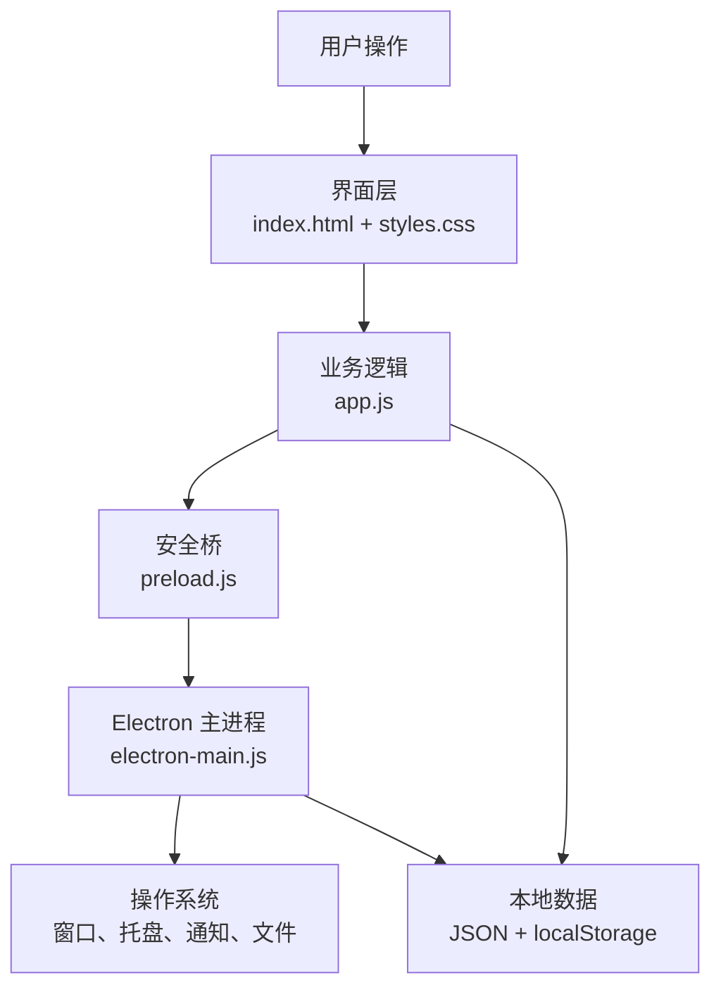

# 青萍

> 风起于青萍之末，成长于点滴之间。

青萍是一款清新、轻量的桌面效率助手。它把今日任务、专注计时、时间回顾、每日感想和阶段计划放进一个安静的悬浮面板里。平时收成一枚气泡，需要时再展开。

<p align="center">
  
</p>

<p align="center">
  <a href="https://github.com/Xueyouing/QingPing/releases/latest">下载最新版</a> ·
  <a href="#功能">功能</a> ·
  <a href="#项目架构">架构</a> ·
  <a href="#本地开发">本地开发</a>
</p>

## 初衷

PC端市面上没有符合本人需求的产品：作为一个桌面气泡小工具 —— 界面好看简约、功能专注任务效率提升、开源本地无广。

所有任务、感想和计划都保存在本地。青萍没有账号系统，也不会把个人记录上传到服务器。

风起于青萍之末，成长于点滴之间。希望这个小工具能高效地陪伴大家的学习工作时光！

## 功能

### 今日任务

- 添加任务、标签和预计专注时长
- 从任务行直接进入计时
- 今日待办、专注时长和完成数量按自然日统计
- 任务较多时独立滚动，不隐藏多余记录

### 专注计时

- 倒计时与正计时
- 默认 45 分钟，支持直接编辑时间
- 支持多个倒计时段排队
- 计时结束后显示青萍浮出动画、休息计时和可选音效

### 回顾与感想

- 青萍环显示任务时间占比
- 柱状涟漪比较不同任务的实际投入
- 放大视图查看完整时间分布
- 每日标题、文字感想和五级心情评分

### 阶段计划

- 为每个主要任务建立独立计划
- 记录状态、起止时间和总体进度
- 按顺序添加阶段目标
- 每个阶段可记录日期、完成状态和阶段笔记

### 桌面气泡与设置

- 面板与悬浮气泡一键切换
- 气泡尺寸、透明度、计时显示和图片可自定义
- 主题配色、预设背景和本地背景图片
- 面板透明度、系统通知和开机自启
- 竹铃、清泉、晚风三套结束音效，可立即试听
- 历史记录导出为 CSV

## 界面

<p align="center">
  
  
  
  
</p>

## 它的特点

- **安静。** 没有强制弹窗和复杂工作流，收起后只留一枚桌面气泡。
- **只看今天。** 今日统计按本地日期自动更新，历史数据不会混进当前任务。
- **可以自己调整。** 主题、背景、透明度、气泡尺寸、气泡图片、提醒音效和休息时间都能修改。
- **数据留在本地。** 不需要注册账号，不依赖远程服务，记录可随时导出。
- **回顾不是考核。** 青萍环和涟漪只负责呈现时间流向，不给一天打绩效分。

## 项目架构

青萍是一个完全运行在用户电脑上的 Electron 应用，没有传统的网络后端和远程数据库。



### 技术栈

| 技术 | 用途 |
| --- | --- |
| HTML / CSS | 页面结构、主题、布局与动画 |
| JavaScript | 任务、计时、回顾、感想和计划逻辑 |
| Electron | 桌面窗口、托盘、通知、开机自启和文件能力 |
| Node.js | Electron 主进程运行环境 |
| Electron Builder | Windows、macOS 和 Linux 安装包构建 |
| NSIS | Windows 安装向导 |

### 主要文件

```text
QingPing/
├── electron-main.js    # Electron 主进程与系统能力
├── preload.js          # 渲染进程和主进程之间的安全桥
├── index.html          # 页面结构
├── styles.css          # 视觉与动画
├── app.js              # 业务状态和交互逻辑
├── assets/             # 图标与本地图片
├── promo/              # 宣传图与制作脚本
└── package.json        # 依赖、运行和构建配置
```

## 下载

正式版本发布在 [GitHub Releases](https://github.com/Xueyouing/QingPing/releases)。青萍 V1.0 提供：

| 系统 | 文件 | 说明 |
| --- | --- | --- |
| Windows 10/11 x64 | `.exe` | NSIS 安装程序 |
| macOS Intel / Apple 芯片 | `.dmg` | Universal 通用安装镜像 |
| Linux x64 | `.AppImage` | 添加执行权限后直接运行 |

当前发布包没有商业代码签名。Windows 首次启动可能显示“未知发布者”；macOS 可能需要在“隐私与安全性”中确认打开。源码和 Release 附件都来自本仓库的 GitHub Actions。

## 本地开发

需要 Node.js 20 或更高版本。

```bash
git clone https://github.com/Xueyouing/QingPing.git
cd QingPing
npm install
npm start
```

检查 JavaScript 语法：

```bash
npm run check
```

## 本地构建

建议在对应操作系统上构建对应安装包：

```bash
npm run dist:win
npm run dist:mac
npm run dist:linux
```

构建结果位于 `release/`。仓库中的 [GitHub Actions 工作流](.github/workflows/release.yml) 会在推送 `v*` 标签时并行构建三个平台，并创建同一版本的 Release。

## 本地数据与隐私

桌面数据保存在 Electron 的 `userData` 目录：

- `qingping-state.json`：任务、设置、感想和计划
- `qingping-history.json`：历史完成记录备份

托盘菜单中的“打开数据目录”可以直接进入该目录。仓库不会提交用户数据、背景图片或其他本地设置。

## 参与开发

可以通过 Issue 反馈问题或提出功能建议。提交代码前请先运行：

```bash
npm run check
```

修改窗口行为时，请同时检查面板态、气泡态和计时结束提醒；修改数据结构时，需要保留旧版本状态迁移。

## 许可证

青萍采用双授权模式：

- 开源授权：[GNU General Public License v3.0 only](LICENSE)。
- 商业授权：如需闭源修改、商业集成、私有分发、OEM 打包或其他不适合 GPLv3 的使用方式，请参考 [Commercial License](COMMERCIAL_LICENSE.md) 与项目维护者联系。
